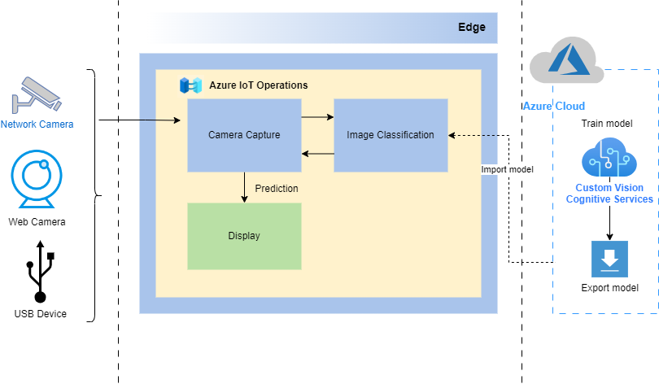
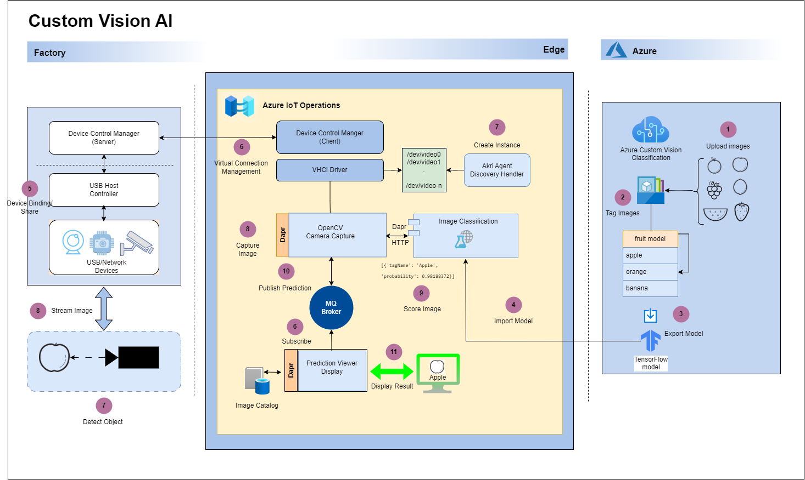

# Custom Vision AI on the Edge  

This is a sample showing how to deploy a Custom Vision model to an edge device running Azure IoT Operations. Custom Vision is an image classifier that is trained in the cloud with your own images. Azure IoT Operations gives you the possibility to run this model in your AKS Edge Essential cluster while providing access to your usb attached or shared network cameras, where the video data is being generated. You can thus add meaning to your video streams to detect road traffic conditions, estimate wait lines, find parking spots, etc. while keeping your video footage private, lowering your bandwidth costs and even running offline.

This sample can also be deployed on an x64 machine (aka your PC) running AKSEE or to a Raspberry Pi.

## Architecture

### Architecture Overview

<p align="center">
    
</p>

### Message Design

As pub/sub pattern is commonly used in edge computing. We design a pub/sub messaging pattern in the Custom Vision on the edge solution to unlock the potential edge computing scenarios with the benefits as below.

The pub/sub pattern is implemented with Azure IoT Operations(AIO) MQ broker and DAPR sidecar.

<p align="center">
    
</p>

## Getting Started

The Azure AI Custom Vision service enables you to create computer vision models that are trained on your own images. You can use it to train image classification and object detection models; which you can then publish and consume from applications.

### Hardware
You can run this solution on the following hardware:

  AKSEE cluster should have 1 Linux node with following spec:
  
- \>= than 8 vCPU (repo tested with 16 vCPU)
- \> 64 GB RAM (repo tested with 32 GB RAM)
- \> 128 GB disk (repo tested with 500 GB disk)

> **Tip:** The sample project uses physical hardware and sets up a live camera feed to train and test the image classifier, which is useful for someone who wants to try a more detailed, real-life scenario. Any standard web cam or usb camera should be sufficient for the image feed.

## Optional Hardware
- **Choose a bare-metal Kubernetes at the edge platform option ([instructions for setting up bare metal kubernetes](https://learn.microsoft.com/en-us/azure/architecture/operator-guides/aks/choose-bare-metal-kubernetes))
- **Raspberry Pi 3, 4, or 5**: Set up Kubernetes (k3s)a Raspberry Pi ([instructions to set up the hardware - use raspbian 11 (bullseye) or above)](https://medium.com/@stevenhoang/step-by-step-guide-installing-k3s-on-a-raspberry-pi-4-cluster-8c12243800b9) + [instructions to setup a layered network in Azure IoT Operations](https://learn.microsoft.com/en-us/azure/iot-operations/manage-layered-network/howto-configure-l3-cluster-layered-network?tabs=k3s)) with a [SenseHat](https://www.raspberrypi.org/products/sense-hat/) and use the arm32v7 tags.

## Services
- Azure Container Registry: This is where you host your containers. Deployment manifests refer to this container registry for the edge devices to download their images.You can use the free sku for this sample.

### Prerequisites

- An Azure subscription. If you don't have an Azure subscription, create a [free account](https://azure.microsoft.com/en-us/free/?WT.mc_id=A261C142F) before you begin.
- A Windows host machine with the spec that is capable to deploy AKSEE and AIO as indicated in the Installation below. You may use a VM or a physical machine.
The solution was tested on Azure VM Windows size Standard D48ds v5, OS version 2022-datacenter-g2.

### Services

- **Azure Container Registry**: This is where you host your containers (e.g. Custom Vision Edge modules). Deployment manifests refer to this container registry for the IoT Edge devices to download their images.You can use the free sku for this sample.

### Installation

- Deploy AKSEE and AIO to your Windows host machine via following the instructions [here](https://learn.microsoft.com/en-us/azure/iot-operations/deploy-iot-ops/howto-prepare-cluster?tabs=aks-edge-essentials).

    For AIO installation for production, at least 8GB-to-16GB RAM, and a 4-core X64 CPU is required as indicated [here](https://engage.cloud.microsoft/main/threads/eyJfdHlwZSI6IlRocmVhZCIsImlkIjoiMjU3NzUwNzU3NzkxMzM0NCJ9?trk_copy_link=V1&domainRedirect=true).

-  Install Dapr runtime and deploy MQ broker pub/sub components on the AKSEE cluster via following the instructions [here](https://learn.microsoft.com/en-us/azure/iot-operations/develop/howto-develop-dapr-apps).

    ```bash
    helm repo add dapr https://dapr.github.io/helm-charts/
    helm repo update
    helm upgrade --install dapr dapr/dapr --version=1.11 --namespace dapr-system --create-namespace --wait

    kubectl apply -f src/custom-vision-mq-components.yaml 
    ```

### Quick Start

1. Download the repo to your local dev machine

    ```bash
    git clone <repo url>
    ```
2. Update the `.\scripts\service-principle.sh` file with the values for your container registry and make sure that your docker engine has access to it 
3. Update the deployment yaml file in each of the `aio-dapr-deploy` directories (e.g. `xxx-dapr-workload.yaml`) with the values for your container registry and make sure that your docker engine has access to it.    
4. Containerize each component: CameraCapture, ImageClassifierService, and SenseHatDisplay from the Dockerfile in the respective component folder for the target platform.

```bash
cd src/camera-capture
docker build -f <platform>.Dockerfile --build-arg SERVER_IP_ADDRESS=<your_server_ip_address> -t <registry host>/camera-capture-<platform>:latest .

cd src/image-classifier-service
docker build -f <platform>.Dockerfile build -t <registry host>/image-classifier-<platform>:latest .

cd src/sense-hat-display
docker build -f <platform>.Dockerfile build -t <registry host>/sense-hat-display-<platform>:latest .
```
Replace <your_server_ip_address> with your actual usb server IP address and <registry host> with your actual registry host or ACR url.

If you want to modify the configuration before containerizing the code, check the details from the the READMEs in the respective component folder.

- [camera-capture README](./src/camera-capture/README.md)
- [image-classifier-service README](./src/image-classifier/README.md)
- [sense-hat-display README](./src/sense-hat-display/README.md)

5. Login your container registry and push the container image to the registry:

For example:

```bash
az acr login --name $ACR_NAME
docker push <registry host>/camera-capture-<plaform>:latest
```
6. Create a secret in the AKSEE cluster to access your container registry with the script provided:

```bash
cd scripts
./service-principal.sh
```

7. Deploy each component
    - camera-capture
    - image-classifier-service
    - sense-hat-display
    
to the AKSEE cluster with /aio-dapr-deploy/xxx-dapr-workload.yaml from the respective component folder. Remember to modify the image url and cluster secret in the yaml file.

```bash
kubectl apply -f xxx-dapr-workload.yaml
```

8. Verify that all the components are deployed successfully on the AKSEE cluster without errors.

```bash
kubectl get pods -n <namespace>
kubectl get service -n <namespace>
kubectl describe pods <pod name> -n <namespace>
kubectl logs <pod name> <container name> -n <namespace>
```

9. Use below command to get web UI service external IP address and the port:

```bash
kubectl get service image-classifier-service-web-service -n <namespace> -o jsonpath="{.status.loadBalancer.ingress[0].ip}:{.spec.ports[0].port}"
```
## Description of the solution
### Modules
This solution is made of 3 deployable modules:

- **Camera capture** - this module captures the video stream from a USB camera, sends the frames for analysis to the custom vision module and shares the output of this analysis to the MQ broker. This module is written in python and uses [OpenCV](https://opencv.org/) to read the video feed.
- **Custom vision** - it is a web service over HTTP running locally that takes in images and classifies them based on a custom model built via the [Custom Vision website](https://azure.microsoft.com/en-us/services/cognitive-services/custom-vision-service/). This module has been exported from the Custom Vision website and slightly modified to run on a ARM architecture. You can modify it by updating the model.pb and label.txt files to update the model.
- **SenseHat display** - this module gets messages from the MQ broker and blinks the raspberry Pi's senseHat according to the tags specified in the inputs messages. This module is written in python and requires a [SenseHat](https://www.raspberrypi.org/products/sense-hat/) to work. The amd64 template does not include this module since it is a raspberry pi only device.


## Demo

## Going further

Create and download your own custom vision model from the [custom vision service](https://learn.microsoft.com/en-us/azure/iot-edge/tutorial-deploy-custom-vision?view=iotedge-1.4). You just need to replace the `image-classifier-service/app/model.pb` and `image-classifier-service/app/labels.txt` provided by the export feature of Custom Vision.

## Update the configuration of the camera capture module

Explore the various configuration options of the [camera module](./src/camera-capture/README.md), to score your ai model against a camera feed vs a video clip, to resize your images, to see logs, etc.

## Resources
- [Azure AI Custom Vision](https://azure.microsoft.com/en-us/products/ai-services/ai-custom-vision)
- [Tutorial:Perform image classification at the edge with Custom Vision Service](https://learn.microsoft.com/en-us/azure/iot-edge/tutorial-deploy-custom-vision?view=iotedge-1.4)
- [Design Patterns: Publisher-Subscriber pattern](https://learn.microsoft.com/en-us/azure/architecture/patterns/publisher-subscriber)
- [What is MQTT and How Does it Work](https://www.techtarget.com/iotagenda/definition/MQTT-MQ-Telemetry-Transport)


