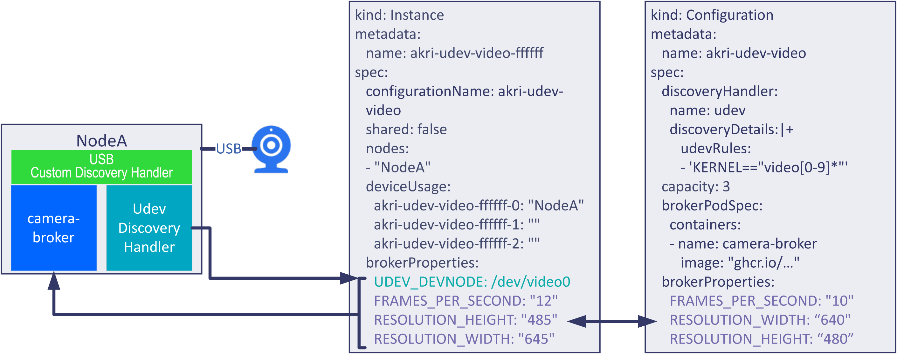
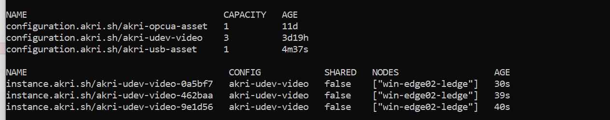

# Azure IoT Operations (AIO) Camera Capture module

This container is an dapr workload that can read a video stream from a camera or from a video file and optionally send frames to capture camera module for processing. It forwards all processing results to the an MQ broker.
It is a Linux Docker container made for AMD64 and ARM processors written in Python.

# Video Streaming Integration with Akri
## Overview
This application serves as an example streaming service for the [ONVIF broker](https://docs.akri.sh/discovery-handlers/onvif) and
[USB camera broker](https://docs.akri.sh/discovery-handlers/udev). It is used in Akri's [end to end
demo](https://docs.akri.sh/demos/usb-camera-demo). Both brokers act as gRPC services that sit on port 8083. The
streaming application creates gRPC clients to connect to the services and repeatedly calls `get_frame` to get the
images. It uses Flask to implement streaming.
## Device Discovery
This application uses a [Custom Discovery Handler](https://docs.akri.sh/development/handler-development) to discover USB cameras. If you want to discover and deploy the USB cameras on your cluster's nodes using Akri, you deploy Akri with a Configuration that uses the [udev Discovery Handler](https://docs.akri.sh/discovery-handlers/udev) to determine what to discover, filter out of discovery, and so on. The udev rule can be modified to exclude certain device nodes, find devices only made by a certain manufacturer, and more. For example, the rule can be narrowed by matching cameras with specific properties. 

<p align="center">
    
</p>
In order for the Akri Agent to know how to discover video devices, the custom Discovery Handler and udev Discovery Handler must exist. By default, a slim Agent without any embedded Discovery Handlers is deployed and the required Discovery Handlers can be deployed as DaemonSets. This application will use that strategy, deploying the custom Discovery Handler and udev Discovery Handlers by specifying `custom.discovery.enabled=true` and `udev.discovery.enabled=true` respectively.

> **Tip:** Please see the [USB Custom Device Discovery Handler](../akri-usb-device-discovery-handler/) for instructions on how to build the discovery handler.

Run the following command to upgrade an existing Akri release with the custom discovery handler and values for the udev handler:

```bash
HOST="<your container registry>"
PLATFORM="amd64"
DH="usb-discovery-handler"
TAGS="latest"
SECRETS="<your pull secret>"

DH_IMAGE="${HOST}/${DH}-${PLATFORM}"
DH_IMAGE_TAGGED="${DH_IMAGE}:${TAGS}"
AKRI_HELM_CRICTL_CONFIGURATION="--set kubernetesDistro=k3s"
BROKER_TAGS="latest"
USB_SERVER_IP="<usb device server ip>"

helm upgrade --install akri akri-helm-charts/akri \ 
$AKRI_HELM_CRICTL_CONFIGURATION \
--set imagePullSecrets[0].name="$SECRETS" \
--set custom.discovery.enabled=true  \
--set custom.discovery.image.repository=$DH_IMAGE \
--set custom.discovery.image.tag=$TAGS \
--set custom.discovery.name=akri-usb-device-discovery \
--set custom.configuration.enabled=true  \
--set custom.configuration.name=akri-usb-asset \
--set custom.configuration.volumeMounts[0].name=lib-modules \
--set custom.configuration.volumeMounts[0].mountPath=/lib/modules \
--set custom.configuration.volumes[0].name=lib-modules \
--set custom.configuration.volumes[0].hostPath.path=/lib/modules \
--set custom.configuration.discoveryHandlerName=akri-usb-device-discovery-handler \
--set custom.configuration.discoveryDetails=$USB_SERVER_IP \
--set custom.configuration.env[0].name=SERVER_IP \
--set custom.configuration.env[0].value=$USB_SERVER_IP \
--set udev.discovery.enabled=true \
--set udev.enabled=true \
--set udev.configuration.name=akri-udev-video \
--set udev.configuration.discoveryDetails.udevRules[0]='KERNEL=="video[0-9]*"' \
--set udev.configuration.brokerPod.image.repository="ghcr.io/project-akri/akri/udev-video-broker" \
--set udev.configuration.brokerPod.image.tag=$BROKER_TAGS \
-n azure-iot-operations
```
Inspect the camera Instances. Notice that in the brokerProperties of each instance, you can see the device nodes (/dev/video1, /dev/video2, etc) that the Instance represents. The brokerProperties of an Instance are set as environment variables in the broker Pods that are utilizing the device the Instance represents. This told the broker which device to connect to. We can also see in the Instance a usage slot and that it was reserved for this node. Each Instance represents a device and its usage.
```bash
kubectl get akrii -n azure-iot-operations
```
<p align="center">
    
</p>

## Limitations
This app streams images in mjpeg (Motion JPEG) format, since all browsers natively support mjpeg. This means this
application will only work on cameras that support MJPG or JPEG. The onvif-video-broker connects to the RTSP stream of
the cameras, which supports JPEG; however, not all usb cameras support MJPG/JPEG. To check that your camera supports
MJPG/JPEG, observe the output of `sudo  v4l2-ctl --list-formats` on the associated node.

## Dependencies
> Note: using a virtual environment is recommended with pip

Install pip:
```
sudo apt-get install -y python3-pip
```
Navigate to this directory and use pip to install all dependencies in `requirements.txt`.
```
pip install -r requirements.txt
```

To clean up, simply run `pip uninstall -r requirements.txt -y`.

## Generating Protobuf Code
Generate using `grpc-tools.protoc`. `grpc-tools` should've been installed in the previous step. 
```
python3 -m grpc_tools.protoc -I./ --python_out=. --grpc_python_out=. camera.proto
```
## Running
- Target all services of an Akri Configuration. The application will query for services prefixed with the Configuration
   name.
```json
    containers: 
          env:
          - name: CONFIGURATION_NAME
            value: "akri-udev-video" # CHANGE TO YOUR CONFIGURATION NAME (if different)
```

## Additional configurations (if not using Akri to discover cameras)
You can use the current conifguration set in the deployment manifest file or update the configuration of this module as follow:

The camera mount path or the video file must be provided through the VIDEO_PATH environment variable:
- Camera mount:
    - In the workload deployment yaml, set volume mounts and `VIDEO_PATH` to the usb camera device:
    ```json
    spec:
      volumes:
        - name: host-modules
          hostPath:
            path: /lib/modules
        - name: dev-video
          hostPath:
            path: /dev
        - name: host-sys
          hostPath:
            path: /sys   
     containers: 
        env:
          - name: VIDEO_PATH
            value: "/dev/video0" # CHANGE TO YOUR VIDEO PATH (if different)
        volumeMounts:
          - name: host-modules
            mountPath: /lib/modules
          - name: dev-video
            mountPath: /dev
          - name: host-sys
            mountPath: /sys                   
    ```
- Video file:
    - Make sure to include the video file in the .Dockerfile:
    ```docker
    ADD ./test/ .
    ```
    - In the workload deployment yaml, set `VIDEO_PATH` to the name of the video file:
    ```json
     containers: 
        env:
          - name: VIDEO_PATH
            value: "./AppleAndBanana.mp4"        
    ```
### For mounted cameras (if not using Akri to discover cameras)   
- Add additional mounted cameras:    
    - To share usb camera device over the network
    ```bash
        cd camera-server
        ./usbip_start.sh usb_device_id
    ```    
    - To stop sharing a usb camera device
    ```bash
        cd camera-server
        ./usbip_stop.sh usb_device_id
    ```
    Replace usb_value with your actual usb device ID value.

    - To run as a service and share a usb camera device on the network at boot, edit the usbip.service file with the usb device ID value
    After editing the usb device id in the usbipd.service file, execute the following commands:
    ```bash
        sudo cp usbipd.service /lib/systemd/system/
        sudo systemctl --system daemon-reload
        sudo systemctl enable usbipd.service
        sudo systemctl start usbipd.service
    ```
    - To verify the service is running
    ```bash
        sudo systemctl status usbipd.service   
        usbip port 
    ```

    - Attach to usb camera device on the network
    ```bash
        cd camera-client
        ./usbip_start.sh server_ip_address usb_device_id
    ```    
    - Detach usb camera device
    ```bash
        cd camera-client
        ./usbip_stop.sh usb_device_id
    ```
    Replace usb_value with your actual server ip and usb device ID value.
    
    - To run as a service and attach to usb camera at boot, edit the usbip.service file with the server ip address and usb device ID value
    ```bash
        nano /lib/systemd/system/usbip.service
    ```
    After editing the server ip address and usb device id in the usbip.service file, execute the following commands:
    ```bash
        sudo cp usbip.service /lib/systemd/system/
        sudo systemctl --system daemon-reload
        sudo systemctl enable usbip.service
        sudo systemctl start usbip.service
    ```
    - To verify the service is running
    ```bash
        sudo systemctl status usbip.service   
        usbip port 
    ```
    

## Optional parameters
The following parameters are optional and can be specified via environment variables in the deployment manifest (See 'createOptions' above).

|Environment variable  |Description  |
|---------|---------|
|IMAGE_PROCESSING_ENDPOINT     | Service endpoint to send the frames to for processing. Example: "http://my-ai-service:8580" (where "my-ai-service" is the name of another workload module). Leave empty when no external processing is needed (Default).  |
|IMAGE_PROCESSING_PARAMS     | Query parameters to send to the processing service. Example: "{'returnLabels': 'true'}". Empty by default. |
|CONFIGURATION_NAME     | Prefix of the Akri configuration to use (e.g. akri-udev-video, akri-onvif)
|SHOW_VIDEO     | Show the video. From a browser, go to "http://YourCameraCaptureIpAdress:5012". Examle: "FALSE". False by default. |
|VERBOSE     |  Show detailed logs and perf timers. Example: "FALSE". False by default.  |
|LOOP_VIDEO     | When reading from a video file, it will loop this video. Example: "TRUE". True by default. |
|CONVERT_TO_GRAY     | Convert to gray before sending to external service for processing. Example: "FALSE". False by default.  |
|RESIZE_WIDTH     | Resize frame width before sending to external service for processing. Example: "256". Does not resize by default (0). |
|RESIZE_HEIGHT     | Resize frame width before sending to external service for processing. Example: "456". Does not resize by default (0). |
