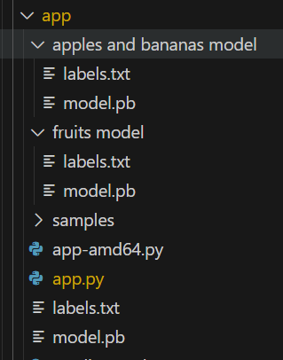

# Azure IoT Operations (AIO) Image Classifier Service

This container is an dapr workload that runs as a web service over HTTP running locally that takes in images and classifies them based on a custom model built via the [Custom Vision website](https://azure.microsoft.com/en-us/services/cognitive-services/custom-vision-service/). This module has been exported from the Custom Vision website and slightly modified to run on a ARM architecture. You can modify it by updating the model.pb and label.txt files to update the model.
> **Tip:**The application uses the apples and bananas model. To use the fruits model, copy the model.pb and label.txt to the app folder.
<p align="left">
    
</p>

## How to build:
To build the Image Classifier application, select and build the docker file for your appropriate architecture.

```bash
cd src/image-classifier-service
docker build -f <platform>.Dockerfile -t <registry host>/image-classifier-service-<platform>:latest .
```
> **Tip:**Replace <your_server_ip_address> with your actual usb server IP address and <registry host> with your actual registry host or ACR url.

Login your container registry and push the container image to the registry:

For example:

```bash
az acr login --name $ACR_NAME
docker push <registry host>/image-classifier-service-<plaform>:latest
```
docker build -t <your image name> .

## How to run locally
Forward the port on your local machine:
kubectl port-forward deployment/image-classifier-service-web-workload 8580:8580 -n azure-iot-operations

Use the command below to get the image processing service endpoint url :
```bash
kubectl logs -f image-classifier-service-web-workload-xxxxx -n azure-iot-operations
```
```output
 * Running on http://127.0.0.1:8580
 * Running on http://10.42.0.208:8580 <--
```

Then use your favorite tool to connect to the end points.

POST http://< service endpoint url >/image with multipart/form-data using the imageData key
e.g
```bash
curl -X POST http://<service endpoint url>/image -F imageData=@some_file_name.jpg
```
POST http://< service endpoint url >/image with application/octet-stream
e.g.
```bash
curl -X POST http://<service endpoint url>/image -H "Content-Type: application/octet-stream" --data-binary @some_file_name.jpg
```
POST http://< service endpoint url >/url with a json body of { "Url": "<test url here>" }
e.g.
```bash
curl -X POST http://<service endpoint url>/url -d "{ \"Url\": \"<test url here>\" }"
```	