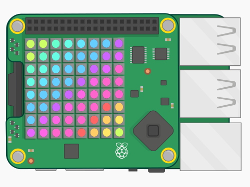

# Azure IoT Operations (AIO) Sense Hat Display application

This container is an dapr workload that gets messages from the MQ broker and blinks the raspberry Pi's senseHat according to the tags specified in the inputs messages. This module is written in python and requires a [SenseHat](https://www.raspberrypi.org/products/sense-hat/) to work. The amd64 template does not include this module since it is a raspberry pi only device.

It is a Linux Docker container made for ARM processors written in Python.

<p align="center">
    
</p>

## Building
To build the Sense Hat Display module, select and build the docker file for your appropriate architecture.

```bash
cd src/sense-hat-display
docker build -f <platform>.Dockerfile -t <registry host>/sense-hat-display-<platform>:latest .
```
> **Tip:**Replace <your_server_ip_address> with your actual usb server IP address and <registry host> with your actual registry host or ACR url.

Login your container registry and push the container image to the registry:

For example:

```bash
az acr login --name $ACR_NAME
docker push <registry host>/sense-hat-display-<plaform>:latest
```

## Running
Deploy the Sense Hat Display application to your cluster with /aio-dapr-deploy/sense-hat-display-dapr-workload.yaml. 

> **Tip:**Remember to modify the image url and cluster secret in the yaml file before you deploy.

```bash
kubectl apply -f sense-hat-display-mq-workload.yaml
kubectl apply -f sense-hat-display-dapr-workload.yaml
```
Upon successful deployment, you should see the Sense Hat cycle through the various model images.
